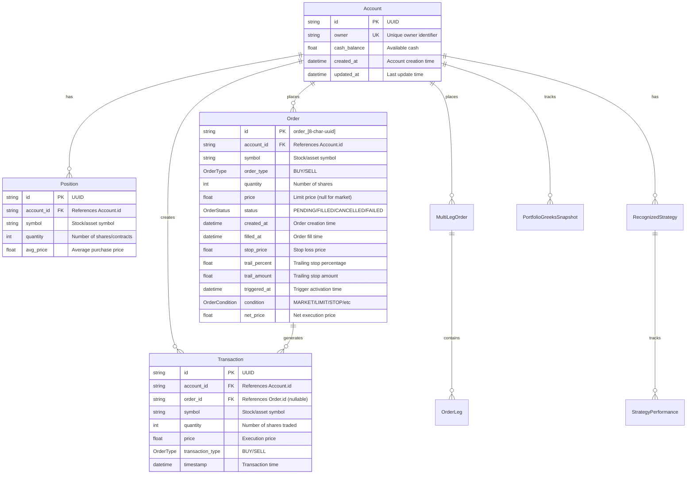
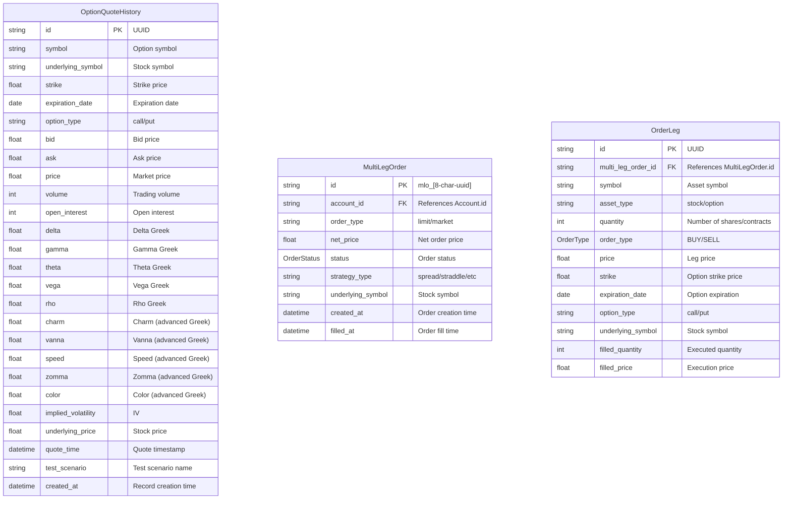
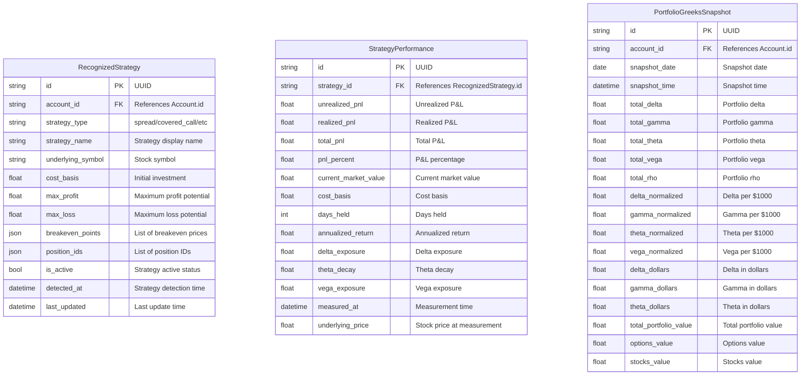
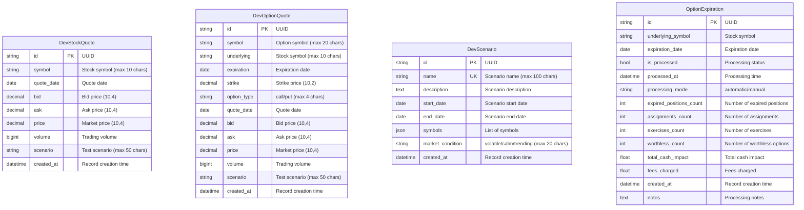

# Database Entity-Relationship Diagram (ERD)

## Core Trading Entities

## Options Trading Entities

## Strategy and Performance Tracking

## Test and Development Data

## Key Database Design Principles

### Primary Keys
- **Accounts**: String UUID for global uniqueness
- **Orders**: Prefixed format `order_[8-char-uuid]` for easy identification
- **Multi-leg Orders**: Prefixed format `mlo_[8-char-uuid]` for easy identification
- **All Others**: Standard UUID strings

### Foreign Key Relationships
- **No CASCADE DELETE**: Referential integrity prevents orphaned records
- **Account-centric**: All trading entities reference Account.id
- **Order tracking**: Transactions optionally reference Order.id

### Unique Constraints
- **Account.owner**: One account per owner
- **DevScenario.name**: Unique test scenario names

### Indexes for Performance
- **Composite indexes** on frequently queried combinations
- **Symbol-based indexes** for market data queries
- **Time-based indexes** for historical analysis
- **Status-based indexes** for order processing

### Data Types
- **Timestamps**: DateTime with automatic server defaults
- **Money**: Float for simplicity (consider Decimal for production)
- **Enums**: SQLAlchemy Enums for order types, statuses, conditions
- **JSON**: For flexible data like breakeven points, position lists